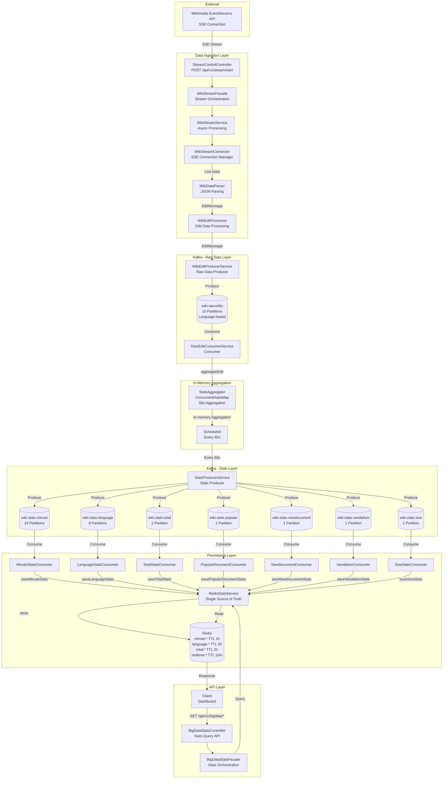

# Wikipedia Real-time Playground

> Real-time dashboard for Wikipedia edit data collection and analysis

[](LICENSE)

Track Wikipedia edits around the world using the real-time Wikipedia API stream.
Real-time Wikipedia edit streaming with Kafka and Redis caching.

## Features

- **Real-time Edit Tracking** - Monitor Wikipedia edits across 300+ languages
- **Statistics Dashboard** - Per-minute, per-language, and total statistics
- **Popular Documents** - Top 10 most edited articles in the last 5 minutes
- **Vandalism Detection** - Track revert, undo, and rollback keywords
- **New Documents** - Monitor newly created articles in real-time

## Architecture

### Overview

```
Wikipedia SSE Stream
    ↓
Kafka Producer
    ↓
wiki.raw.edits Topic (16 partitions)
    ↓
Consumer → In-memory Aggregation
    ↓
@Scheduled (every 60s)
    ↓
wiki.stats.* Topics (8 topics)
    ↓
Consumers → Redis Cache
    ↓
REST API → React Dashboard
```

### Full System Architecture



### Tech Stack

**Backend**
- Java 21, Spring Boot 3.5
- Apache Kafka (message streaming)
- Redis (caching layer)
- Docker (infrastructure)

**Frontend**
- React 19, TypeScript
- Vite, TailwindCSS
- Recharts, React Query

## Quick Start

Get started in under 2 minutes with Docker:

```bash
# Download docker-compose file
curl -O https://raw.githubusercontent.com/zzjiho/wiki-beat/main/docker/docker-compose.quick.yml

# Start all services
docker compose -f docker-compose.quick.yml up -d

# Wait for services to start (~30 seconds), then start streaming
curl -X POST http://localhost:8888/api/v1/stream/start

# Open dashboard at http://localhost:5173
```

All required images (Kafka, Redis, backend, frontend) will be automatically downloaded from registries.

## Development Setup

For contributors who want to modify the code:

```bash
git clone https://github.com/zzjiho/wiki-beat.git
cd wiki-beat/docker

# Start infrastructure only (Kafka, Redis, monitoring tools)
docker compose -f docker-compose.local.yml up -d

# Run backend (new terminal)
cd ../wiki-back
./gradlew bootRun --args='--spring.profiles.active=dev'

# Run frontend (new terminal)
cd ../wiki-front
npm install && npm run dev

# Start streaming
curl -X POST http://localhost:8888/api/v1/stream/start

# Open dashboard at http://localhost:5173
```

## Kafka Topics

| Topic | Partitions | Interval | Description |
|-------|-----------|----------|-------------|
| `wiki.raw.edits` | 16 | Real-time | Individual edit events |
| `wiki.stats.minute` | 24 | 60s | Per-minute aggregated stats |
| `wiki.stats.language` | 8 | 60s | Language statistics |
| `wiki.stats.total` | 1 | 60s | Total statistics |
| `wiki.stats.popular` | 1 | 60s | Popular documents Top 10 |
| `wiki.stats.vandalism` | 1 | 60s | Vandalism detection |

## Contributing

Contributions are always welcome!

- Report bugs
- Suggest features
- Submit pull requests

**Ideas for contributors:**
- WebSocket real-time updates
- Time-based heatmap visualization
- Discord/Slack webhook integration
- Multi-language UI support

## License

MIT License - See [LICENSE](LICENSE) for details

## Acknowledgments

- [Wikimedia](https://www.wikimedia.org/) - For providing free real-time stream API
- Wikipedia editors - For creating the data

---

Star if you find it interesting! 
